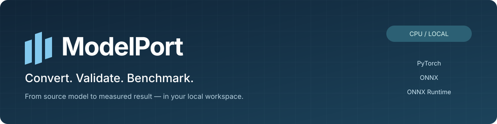
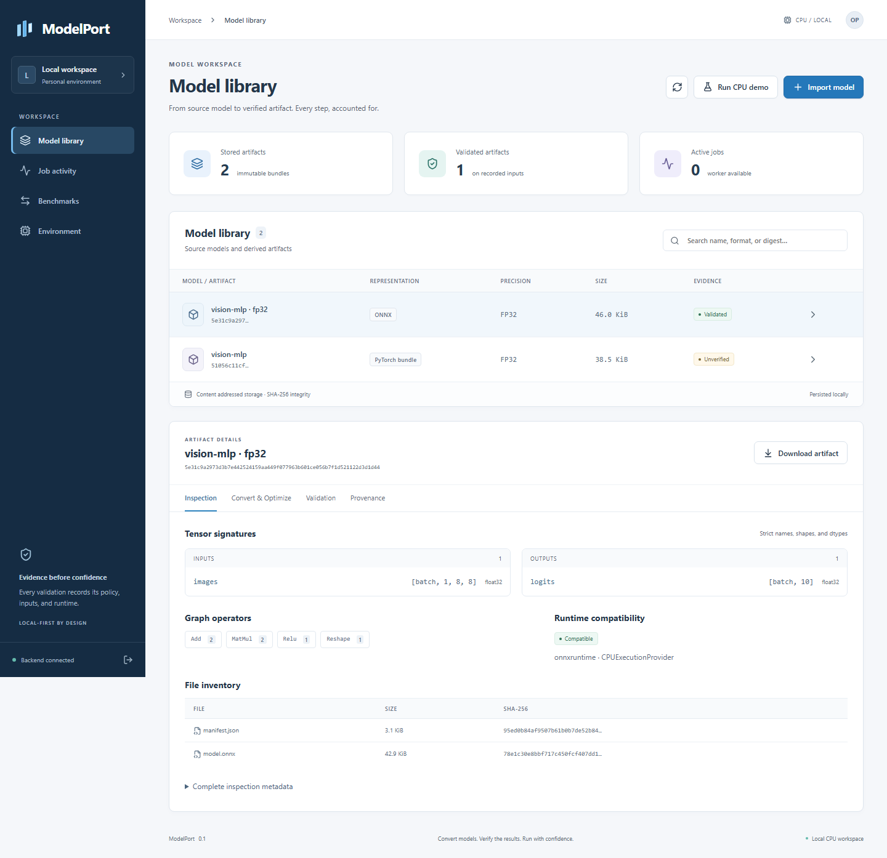
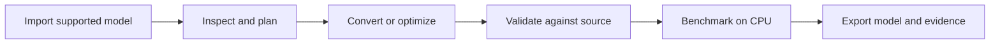

<p align="center">
  
</p>

<p align="center">
  <a href="https://github.com/AlBrmagawi/modelport/actions/workflows/ci.yml"></a>
  <a href="docs/getting-started.md"></a>
  <a href="docs/capability-matrix.md"></a>
  <a href="LICENSE"></a>
</p>

<p align="center">
  <strong>A local workspace for converting AI models and checking whether the result is worth deploying.</strong>
</p>

<p align="center">
  <a href="#quickstart">Quickstart</a> ·
  <a href="docs/getting-started.md">Installation guide</a> ·
  <a href="docs/README.md">Documentation</a> ·
  <a href="https://github.com/AlBrmagawi/modelport/archive/refs/heads/main.zip">Download source</a> ·
  <a href="CONTRIBUTING.md">Contribute</a>
</p>

ModelPort brings **PyTorch, ONNX and ONNX Runtime** into one workflow: import a
supported model, create optimized variants, compare their outputs with the original,
and measure inference on your own CPU. Use the web dashboard, Python SDK, CLI or
authenticated REST API. Models and reports stay in your local workspace.

**Status:** 0.1.0 CPU beta. Windows x64 and Linux x64 are the verified platforms.
The demo generates its own small model and needs no pretrained-model download.



## Why ModelPort?

| Capability | What you get |
| --- | --- |
| Convert and optimize | PyTorch → ONNX, graph optimization, dynamic/static INT8 and FP16 graph conversion |
| Verify the result | Actual source-versus-target predictions, per-output numerical gates and explicit evidence states |
| Measure performance | Real latency samples, throughput, memory, model size and downloadable JSON/CSV/HTML reports |
| Keep the evidence | Immutable artifacts, source provenance, persistent job history, cancellation and recoverable attempts |
| Work your way | React dashboard, Python SDK, CLI, REST API and a local Docker app |

Quantization can reduce size without improving latency. ModelPort records what
actually happened. Numerical agreement on test inputs is separate from real-world
task accuracy.

## Quickstart

### Docker — recommended

Install [Docker Desktop or Docker Engine with Compose](https://docs.docker.com/get-started/get-docker/).
On Windows, start Docker Desktop with its Linux container engine.

```sh
git clone https://github.com/AlBrmagawi/modelport.git
cd modelport
docker compose -f docker/compose.yml up -d --build
docker compose -f docker/compose.yml exec modelport modelport token
```

1. Open **http://127.0.0.1:8765**.
2. Copy the value of `token` from the command output into **Operator token**.
3. Click **Open workspace**, then **Run CPU demo**.

On a fresh workspace, the demo creates a PyTorch source, FP32 ONNX, optimized ONNX
and dynamic INT8 model, with validation and benchmark results. Select a model to
inspect its tensors, compare evidence and download its artifact.

**Windows shortcut:** after cloning or extracting the source ZIP, double-click
`start-modelport.cmd`. It starts Docker Desktop if needed, builds the app, displays
the token and opens the browser. Subsequent launches can use
`start-modelport.cmd -NoBuild`.

The first build downloads the required libraries. Docker handles Python, Node and
CPU dependencies. Model data persists in a Docker volume.

```sh
# Stop the app and retain its data
docker compose -f docker/compose.yml stop

# View service status and recent logs
docker compose -f docker/compose.yml ps
docker compose -f docker/compose.yml logs --tail 100
```

### Python development setup

Install [uv](https://docs.astral.sh/uv/getting-started/installation/) and
[Node.js 24](https://nodejs.org/en/download). From the cloned repository:

```sh
uv sync --locked --extra cpu
cd web
npm ci
npm run build
cd ..
uv run --no-sync modelport demo --output ./demo-results
uv run --no-sync modelport token
uv run --no-sync modelport serve
```

`uv` creates `.venv` and can download Python 3.12. The lockfile selects the CPU-only
PyTorch build. In Windows PowerShell, use `npm.cmd` for the npm commands.

See the **[complete installation guide](docs/getting-started.md)** for prerequisite
downloads, platform-specific commands, first-run checks, alternate ports and
updates. The **[dependency reference](docs/dependencies.md)** explains every major
library and how it is installed.

## The workflow



Routes become selectable after real environment probes pass. Compatibility is
checked again for the specific model. Failed validation remains visible and blocks
normal validated loading; a written file alone is not counted as a successful result.

| Input | Support in this release |
| --- | --- |
| Registered PyTorch bundle + SafeTensors | Import, inspect, infer and export through the modern ONNX exporter |
| Standard-domain ONNX | Inspect and infer with ONNX Runtime CPU; optimize, quantize eligible MatMul/Gemm graphs, convert to FP16 |
| Public HTTPS / pinned Hugging Face files | Explicit file lists, full Hub commit revisions, SHA-256 checks and bounded downloads |
| SafeTensors without a bundle | Inspect weights; execution requires an explicit registered architecture |

The built-in PyTorch architectures are `vision-mlp` and `dual-input`, version 1.
Static INT8 requires separate calibration and validation datasets. FP16 graph
storage does not promise native FP16 CPU arithmetic. See the
[capability matrix](docs/capability-matrix.md), [bundle format](docs/model-bundle.md)
and [dataset guide](docs/datasets.md).

## Python SDK

```python
from pathlib import Path

import numpy as np

from modelport import ModelPort

with ModelPort.local(data_dir=".modelport") as client:
    source = client.fixture("vision-mlp")
    converted = client.convert(client.plan(source.artifact_id), wait=True)

    report = client.validate(
        source.artifact_id, converted.artifact_id, policy="fp32-default"
    )
    report.require_passed()

    with client.load(converted.artifact_id, require_validated=True) as model:
        outputs = model.predict({
            "images": np.zeros((4, 1, 8, 8), dtype=np.float32)
        }).outputs
        assert outputs["logits"].shape == (4, 10)

    client.export_artifact(converted.artifact_id, Path("converted.zip"))
```

Import your own supported bundle with `client.import_model("./example-bundle")`.
Try [multiple inputs and dynamic batches](examples/multiple_inputs.py),
[a deliberate validation failure](examples/failure.py), or the
[pinned remote examples](docs/remote-imports.md).

## Documentation

| Start here | Go deeper |
| --- | --- |
| [Installation and first run](docs/getting-started.md) | [Architecture and job lifecycle](docs/architecture.md) |
| [Libraries and dependency installation](docs/dependencies.md) | [Validation policies](docs/validation.md) |
| [Reproducible demo](docs/demo.md) | [Benchmark methodology](docs/benchmarking.md) |
| [Troubleshooting](docs/troubleshooting.md) | [Deployment, backup and restore](docs/deployment.md) |
| [Security boundary](SECURITY.md) | [Writing an adapter](docs/adapter-authoring.md) |

The running app serves an offline endpoint reference at `/docs` and its typed
contract at `/openapi.json`. Browse the [documentation index](docs/README.md) for
the complete guide.

## Quality and contributions

The local verification run passed **106 Python tests on Windows and 106 on Linux**,
with one platform-specific skip on each. It also passed the real browser workflow,
an offline Docker demo, installed-wheel checks and dependency/secret scans.
See the [pre-push report](docs/pre-push-review.md) for scope and evidence.

GitHub Actions runs Python checks on Windows and Ubuntu, frontend and browser
tests, dependency audits, secret scans, package checks and Linux Docker tests.
The badge above shows its current status.

```sh
uv run --no-sync python scripts/check.py
```

Read [CONTRIBUTING.md](CONTRIBUTING.md) for the full quality-check sequence and
development workflow. Use [issues](https://github.com/AlBrmagawi/modelport/issues)
for reproducible bugs and scoped feature requests. See [SUPPORT.md](SUPPORT.md),
[CHANGELOG.md](CHANGELOG.md) and the [roadmap](docs/roadmap.md).

## Scope and distribution

ModelPort is a **local, single-operator CPU application**. Native subprocesses
provide fault isolation; they are not a public hostile-tenant security sandbox.
Uploaded Python, pickle checkpoints, custom operator libraries and arbitrary
architectures are rejected. GPU, macOS and additional runtime adapters are outside
the verified release scope.

Build downloadable packages with `uv run --no-sync python scripts/release.py`.
The output includes a wheel with the dashboard, source ZIP/tarball, dependency
inventory, notices and SHA-256 checksums. See [release instructions](docs/release-notes.md).
No published PyPI package is required for the documented setup.

Licensed under **[Apache-2.0](LICENSE)**. Bundled third-party notices are retained;
downloaded example-model weights are not included. See [THIRD_PARTY_NOTICES.md](THIRD_PARTY_NOTICES.md).
