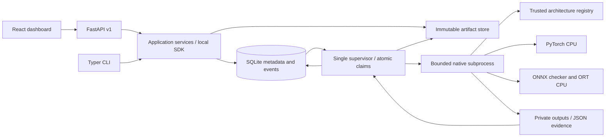
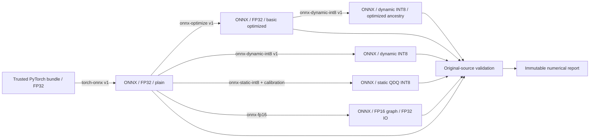

# Architecture

`domain.py` defines Pydantic contracts without framework imports. `ports.py` defines
runtime, inspection, input-provider and execution-context boundaries. `sdk.py`
implements application services; CLI and API delegate to them. `native.py`,
`architectures.py`, `storage.py` and `persistence.py` implement the CPU/filesystem/SQL
adapters. Related small modules are kept together rather than creating empty layers.

The graph search is deterministic, bounded to 32 visited states and 3 transformations,
and ordered by lossiness, transformation count and adapter ID. State includes format,
architecture version, precision, optimization, opsets, domains, runtime and provider.
Plans contain exact options, prerequisites, unresolved probes, alternatives and an
environment/code fingerprint. Unknown architectures and unprobed adapters cannot
be selected. Inspecting a graph does not prove arbitrary export will succeed.

The application uses one local SQLite queue with `BEGIN IMMEDIATE` claims and short
transactions, WAL, foreign keys and a busy timeout. Events have per-job monotonic
sequence IDs. Attempts have unique tokens and heartbeats. Publication rechecks the
token and cancellation intent. Native work never holds a database transaction open.

Native children receive a private directory, a minimal environment, bounded JSON
IPC, progress callbacks, thread limits and deadlines. They cannot publish through
an application interface or write database results. The supervisor owns publication.
This boundary is fault isolation, **not** an OS security sandbox: the process still
runs as the local operator and can access resources permitted to that user.

Complete intermediate native steps can be checkpointed privately and reused by a
retry of the same plan only after digest verification. An interrupted native step
restarts. Prior attempts and events remain intact. There is no instruction-level
exporter resumption, distributed lease service, or general conversion-result cache.

The deployment can grow through repository/queue/artifact-store adapters, but SQLite
must stay on a local filesystem. Adding multiple machines requires a real shared
object store and transactional queue/fencing implementation; copying SQLite to NFS
does not provide distributed execution.

See [decision records](adr/0001-core-design.md) and [adapter guide](adapter-authoring.md).
